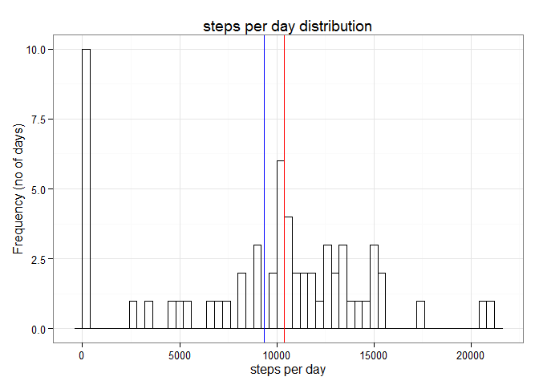
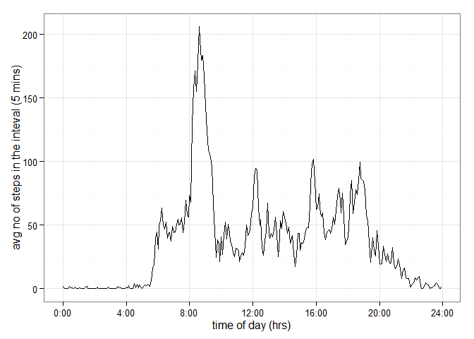
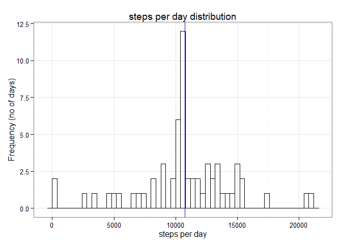
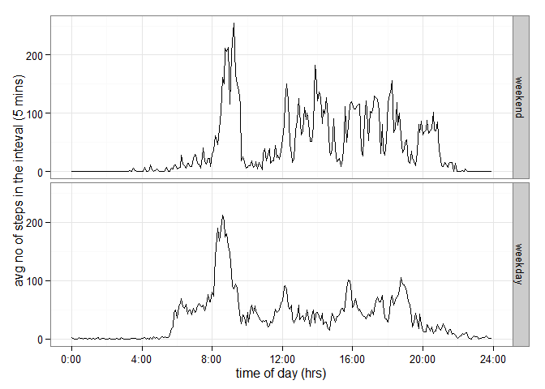

# Reproducible Research: Peer Assessment 1


## Loading and preprocessing the data

Let's first load the data from the provided zip file. After loading the actual cvs file, we take first look at the data to understand more about the format.


```r
theData <- read.csv(unz("activity.zip", "activity.csv"))
totalRows <- nrow(theData)

str(theData)
```

```
## 'data.frame':	17568 obs. of  3 variables:
##  $ steps   : int  NA NA NA NA NA NA NA NA NA NA ...
##  $ date    : Factor w/ 61 levels "2012-10-01","2012-10-02",..: 1 1 1 1 1 1 1 1 1 1 ...
##  $ interval: int  0 5 10 15 20 25 30 35 40 45 ...
```

We have now all 17568 rows in memory as expected. 

In order to simplify our analysis later I convert date to POSIXlt and interval to minutes from 00:00 ( note that in the current format 04:05 is not 245 but 405). 


```r
theData$interval_min <- 60*floor((theData$interval+1)/100) + (theData$interval %% 100)
theData$date_dt <- strptime( theData$date, "%Y-%m-%d")

str(theData)
```

```
## 'data.frame':	17568 obs. of  5 variables:
##  $ steps       : int  NA NA NA NA NA NA NA NA NA NA ...
##  $ date        : Factor w/ 61 levels "2012-10-01","2012-10-02",..: 1 1 1 1 1 1 1 1 1 1 ...
##  $ interval    : int  0 5 10 15 20 25 30 35 40 45 ...
##  $ interval_min: num  0 5 10 15 20 25 30 35 40 45 ...
##  $ date_dt     : POSIXlt, format: "2012-10-01" "2012-10-01" ...
```

## What is mean total number of steps taken per day?

Using tapply we can "group" theData per date and run the sum function per group, which gives us total number of steps per date just as needed.


```r
totalStepsPerDate <- tapply( theData$steps, theData$date, sum, na.rm = T)
str(totalStepsPerDate)
```

```
##  int [1:61(1d)] 0 126 11352 12116 13294 15420 11015 0 12811 9900 ...
##  - attr(*, "dimnames")=List of 1
##   ..$ : chr [1:61] "2012-10-01" "2012-10-02" "2012-10-03" "2012-10-04" ...
```

```r
stepsMean <- mean( totalStepsPerDate, na.rm = T)
stepsMean
```

```
## [1] 9354.23
```

```r
stepsMedian <- median( totalStepsPerDate, na.rm = T)
stepsMedian
```

```
## [1] 10395
```

Now we can look at the frequency of the days with the given number of steps using historgram. Before plotting with ggplot the data is encapsulated in data.frame.


```r
library(ggplot2)

theDF = data.frame( totalStepsPerDate )
names(theDF) <- c("steps")

theHist <- ggplot( theDF, aes(x=steps)) + geom_histogram(color="black", fill=NA, binwidth = 400) + labs( x = "steps per day", y ="Frequency (no of days)", title ="steps per day distribution") + theme_bw()
theHist <- theHist + geom_vline(aes(xintercept=stepsMedian, color="median"), color="red" ) 
theHist <- theHist + geom_vline(aes(xintercept=stepsMean, color="mean"), color="blue")

theHist
```

 


The mean (9354.2295082) is represented by blue vertical line and median (10395) as red one. 

We can see that there are many days with little activity, which is probably the result of missing data.

## What is the average daily activity pattern?

In order to calculate average number of steps per interval, we use tapply again. 


```r
avgStepsPerIntervalPerDay <- tapply( theData$steps, theData$interval_min, mean, na.rm = T)
```

We convert the data to a data.frame, and introduce mins column to show the time properly on the graph.


```r
theDF <- data.frame( avgStepsPerIntervalPerDay )
theDF$mins <- as.numeric(names(avgStepsPerIntervalPerDay))/60
names( theDF ) <- c("steps", "mins")
```

Now we can plot it as time series


```r
myTS <- ggplot( theDF, aes(x=mins, y=steps)) + geom_line() 
myTS <- myTS + scale_x_continuous(breaks=seq(0,24,by=4), labels=paste(seq(0,24, by=4),":00", sep=""))
myTS <- myTS + labs( x="time of day (hrs)", y="avg no of steps in the inteval (5 mins)") + theme_bw()
myTS
```

 

We can see on the plot that the maximum steps are taken some time after 8. Let's see what time exactly.


```r
maxInterval <- as.numeric(names(avgStepsPerIntervalPerDay[  which( avgStepsPerIntervalPerDay == max(avgStepsPerIntervalPerDay)) ] ))/60
myHrs <- floor(maxInterval) 
myMins <- (maxInterval - myHrs)*60

sprintf("on average most steps (%d) are taken at %02d:%02d", floor(max(avgStepsPerIntervalPerDay)), floor(myHrs), floor(myMins))
```

```
## [1] "on average most steps (206) are taken at 08:35"
```

## Imputing missing values

There are many missing values in the data set


```r
sum(is.na(theData$steps))
```

```
## [1] 2304
```

We fill the missing data with the averages calculated previously


```r
theAdjustedData <- transform( theData, steps = ifelse( is.na( steps ), avgStepsPerIntervalPerDay, steps ) )

sum(is.na(theAdjustedData))
```

```
## [1] 0
```

Let's now calculate total number of steps per day, mean and median again on the adjusted data.


```r
adjustedTotalStepsPerDay <- tapply( theAdjustedData$steps, theAdjustedData$date, sum, na.rm = T)

adjustedStepsMean <- mean( adjustedTotalStepsPerDay, na.rm = T)
adjustedStepsMean
```

```
## [1] 10766.19
```

```r
adjustedStepsMedian <- median( adjustedTotalStepsPerDay, na.rm = T)
adjustedStepsMedian
```

```
## [1] 10766.19
```

```r
totalOriginal <- sum(theData$steps, na.rm=TRUE)
totalOriginal
```

```
## [1] 570608
```

```r
totalAdjusted <- sum(theAdjustedData$steps, na.rm=TRUE)
totalAdjusted
```

```
## [1] 656737.5
```

We can see that the median and the mean are equal now, and that the total number of steps increased by 86129

We can plot it again to better see the difference between the original data and the adjusted one.


```r
theDF = data.frame( adjustedTotalStepsPerDay )
names(theDF) <- c("steps")

theHist <- ggplot( theDF, aes(x=steps)) + geom_histogram(color="black", fill=NA, binwidth = 400) + labs( x = "steps per day", y ="Frequency (no of days)", title ="steps per day distribution") + theme_bw()
theHist <- theHist + geom_vline(aes(xintercept=adjustedStepsMedian, color="median"), color="red") 
theHist <- theHist + geom_vline(aes(xintercept=adjustedStepsMean, color="mean"), color="blue" )
theHist
```

 

The mean (1.0766189\times 10^{4}) and median (1.0766189\times 10^{4}) overlap now.  

If we compare the histogram with the previous version we can also see that the number of days with little activity is much lower now. That proves that the "no activity days" were indeed introduced by incorrect data.

## Are there differences in activity patterns between weekdays and weekends?

In order to compare the activity between weekdays and weekends we need to introduce a column indicating it first. We use previously introduced date_dt column of POSIX type for it.


```r
theAdjustedData$day <- factor( theAdjustedData$date_dt$wday < 6, labels = c("weekend", "weekday"))
head( theAdjustedData )
```

```
##       steps       date interval interval_min    date_dt     day
## 1 1.7169811 2012-10-01        0            0 2012-10-01 weekday
## 2 0.3396226 2012-10-01        5            5 2012-10-01 weekday
## 3 0.1320755 2012-10-01       10           10 2012-10-01 weekday
## 4 0.1509434 2012-10-01       15           15 2012-10-01 weekday
## 5 0.0754717 2012-10-01       20           20 2012-10-01 weekday
## 6 2.0943396 2012-10-01       25           25 2012-10-01 weekday
```

Now we can calculate averages grouping it with tapply function on both interval and day (weekend/weekday)

```r
adjustedAvgStepsPerIntervalPerDay <- tapply( theAdjustedData$steps, list(theAdjustedData$interval_min, theAdjustedData$day), mean, na.rm = T)

str(adjustedAvgStepsPerIntervalPerDay)
```

```
##  num [1:288, 1:2] 0.21462 0.04245 0.01651 0.01887 0.00943 ...
##  - attr(*, "dimnames")=List of 2
##   ..$ : chr [1:288] "0" "5" "10" "15" ...
##   ..$ : chr [1:2] "weekend" "weekday"
```


Before plotting we convert calculated averages into a data.frame again


```r
library(reshape2)
theDF <- melt( adjustedAvgStepsPerIntervalPerDay, id="rownames")
names( theDF ) <- c("interval", "day", "steps")

theDF$mins <- theDF$interval / 60
head(theDF)
```

```
##   interval     day       steps       mins
## 1        0 weekend 0.214622642 0.00000000
## 2        5 weekend 0.042452830 0.08333333
## 3       10 weekend 0.016509434 0.16666667
## 4       15 weekend 0.018867925 0.25000000
## 5       20 weekend 0.009433962 0.33333333
## 6       25 weekend 0.261792453 0.41666667
```

Finally using facets in ggplot2 we can draw two timeseries above each other, based on the weekday/weekend factor introduced before.


```r
myTS <- ggplot( theDF, aes(x=mins, y=steps)) + geom_line()
myTS <- myTS + scale_x_continuous(breaks=seq(0,24,by=4), labels=paste(seq(0,24, by=4),":00", sep=""))
myTS <- myTS + labs( x="time of day (hrs)", y="avg no of steps in the inteval (5 mins)")
myTS <- myTS + theme_bw() + facet_grid(day ~ .) 
myTS
```

 

Comparing those two plots, we can see that we walk more in the weekend. Between 12 and 16 there are more steps taken. We begin later (after 8) and stay active until the evening  (after 20). 

What we see on the graph, seems to be right and reflecting common sense about our activity in free time.
